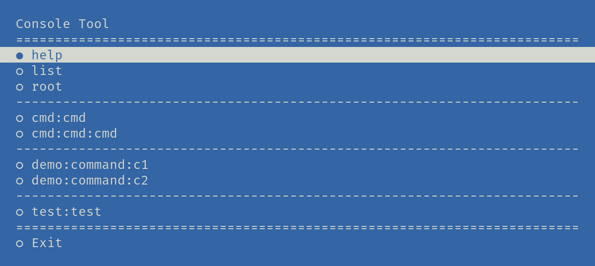

Console Menu
############

|Packagist| |GitLab| |GitHub| |Codeberg| |Gitea|

Command list menu for `Symfony Console`_.

Installation
============

.. code-block:: bash

   composer require arokettu/console-menu

Screenshots
===========

   The menu

   If command has any parameters, a param input will be shown

Usage
=====

Just add a ``ConsoleMenuCommand`` to the Console Application:

.. code-block:: php

    <?php

    $app = new \Symfony\Component\Console\Application();

    $app->add(new \Arokettu\ConsoleMenu\ConsoleMenuCommand());

It will add a new command named menu:

.. code-block:: bash

    php app.php menu

License
=======

The library is available as open source under the terms of the `MIT License`_.

.. _Symfony Console:    https://symfony.com/doc/current/components/console.html
.. _MIT License:        https://opensource.org/licenses/MIT

.. |Packagist|  image:: https://img.shields.io/packagist/v/arokettu/console-menu.svg?style=flat-square
   :target:     https://packagist.org/packages/arokettu/console-menu
.. |GitHub|     image:: https://img.shields.io/badge/get%20on-GitHub-informational.svg?style=flat-square&logo=github
   :target:     https://github.com/arokettu/console-menu
.. |GitLab|     image:: https://img.shields.io/badge/get%20on-GitLab-informational.svg?style=flat-square&logo=gitlab
   :target:     https://gitlab.com/sandfox/console-menu
.. |Codeberg|   image:: https://img.shields.io/badge/get%20on-Codeberg-informational.svg?style=flat-square&logo=codeberg
   :target:     https://codeberg.org/sandfox/console-menu
.. |Gitea|      image:: https://img.shields.io/badge/get%20on-Gitea-informational.svg?style=flat-square&logo=gitea
   :target:     https://sandfox.org/sandfox/console-menu
